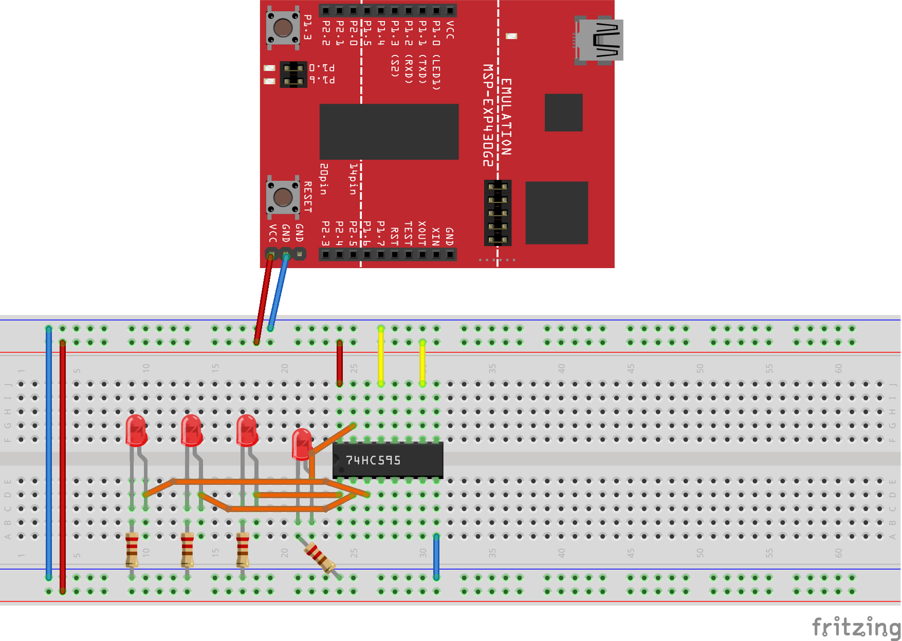
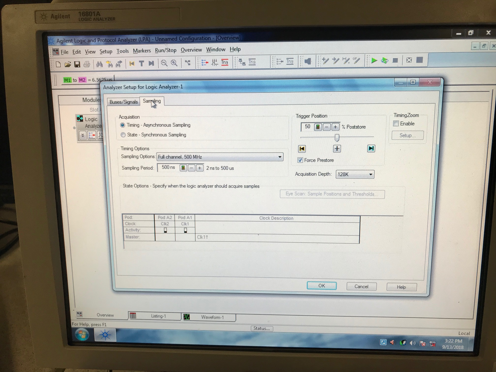
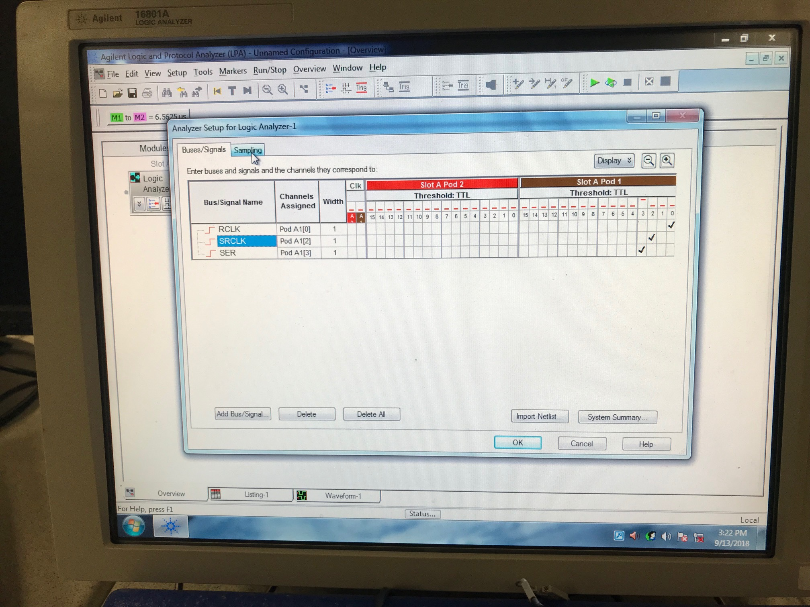
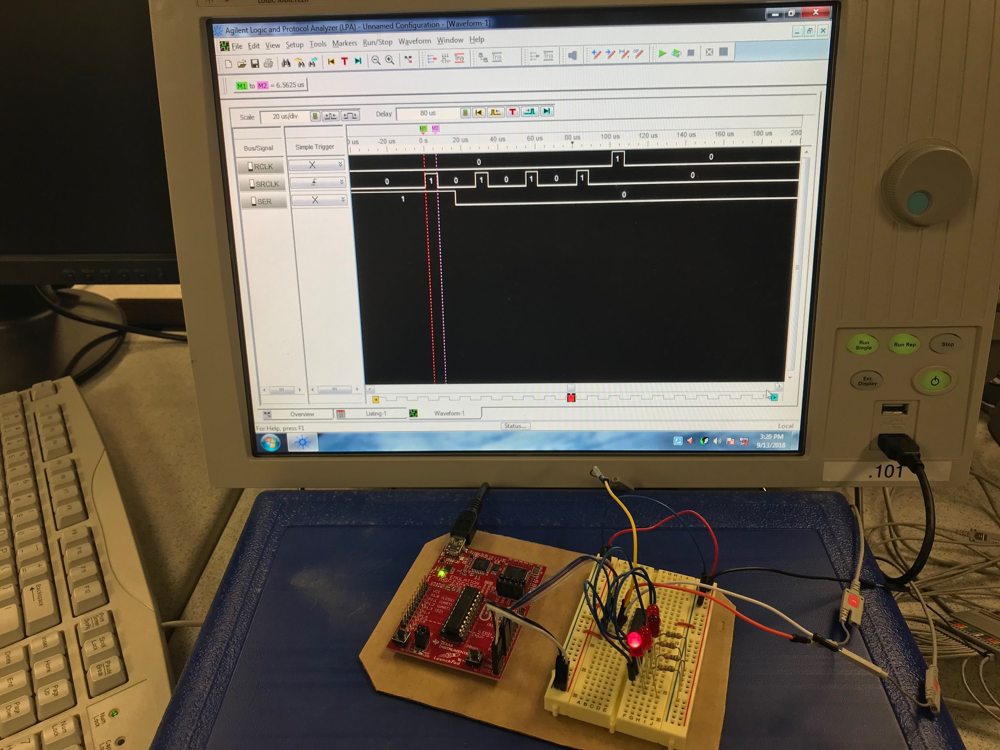
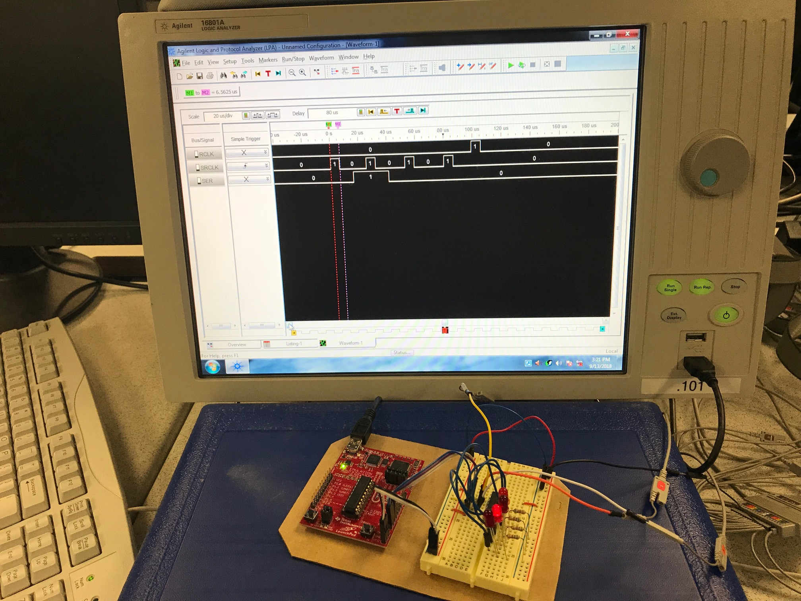
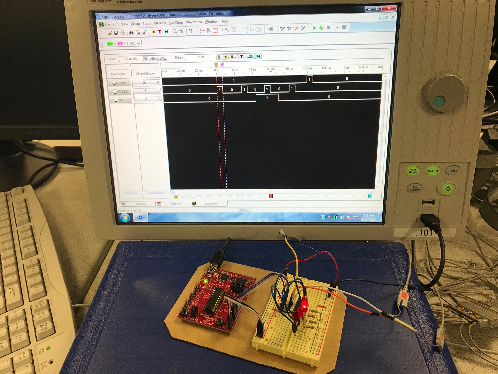
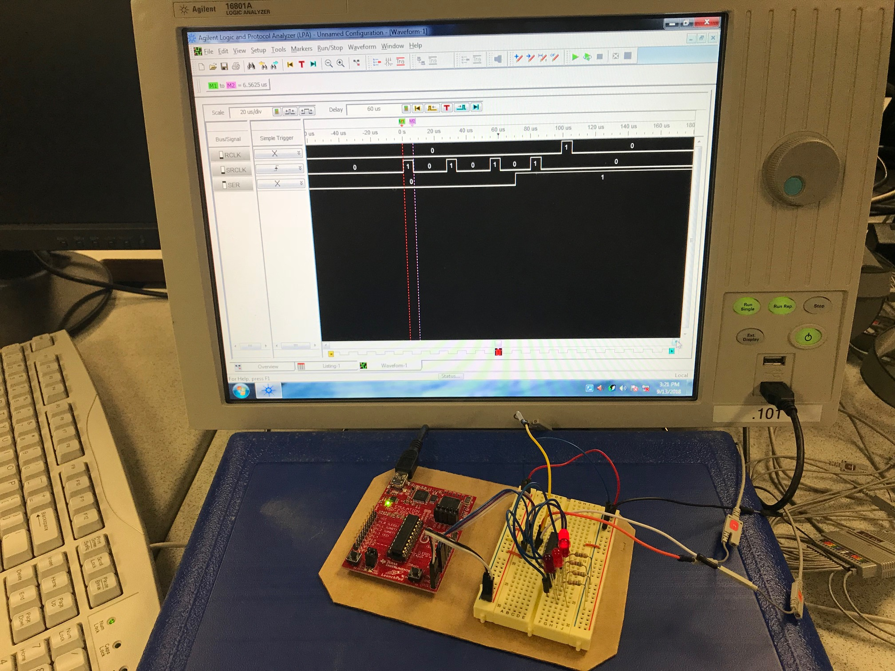
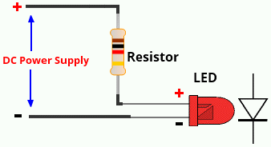

# Lab 2 - Stoplight

## Objectives

- Learn to characterize and debounce a button in SW
- Learn to use the logic analyzer to characterize digital signals
- Learn external HW communications

## References

- [How a 74HC595 shift register works](https://www.youtube.com/watch?v=gZ2oEjQgtcM) gives a simple overview of how you can clock data into the shift register.
- [74HC595 datasheet](https://marsuniversity.github.io/ece382/references/sn74hc595.pdf)
- [BEGINNER’S GUIDE TO THE 595 SHIFT REGISTER](http://www.idogendel.com/en/archives/211)

# Directions

## Debounced Button

Using the your knowledge and experience from class. First implement a button with
a software delay so the uC only registers 1 button press when the button is hit.

## SN74HC595 Shift Register

{width=75%}

Now, wire up your shift register according to the datasheet. A suggested setup
is shown above. Note, the command wires going from your Launchpad to the 595 **are
not shown**. You get to pick which pins you want to use and how they get wired up.

To verify your uC is sending the correct commands to the 595, hook it up to the
logic analyzer. Make sure you understand how the `SRCLK`, `SER`, and `RCLK` works
in order to verify the signal on the logic analyzer.

### Bits: 1000

### Bits: 0100

### Bits: 0010

### Bits: 0001

### Wiring Up LEDs

{width=300px}

LEDs are polarized, meaning, if you hook them up backwards, you will destroy them.
The key feature on every through hole LED is the flat side which indicates it
is the side you attach to ground.

Most LEDS, like the ones we have for our lab, can handle between 2 and 20 mA of
current. Too much, and you will destroy the LED. So we need to put a current
limiting resistor in there.

## Operation

Once you have everything hooked up, you need to write assembly code to:

- When the button is pushed, the LED attached to $Q_A$ lights up
- When the button is pushed again, $Q_A$ turns off and $Q_B$ turns on
- Subsequent button pushes cause the lit LED to shift to the next pin.
- Finally, when you push the button, the lite LED wraps around from $Q_D$ to $Q_A$
and it continues on again
- One button push should correlate to one shift of the LED
    - This is where debouncing comes in

### Software

The 595 chip is basically a serial data in, parallel data out converter. Later
we will talk about different types of serial communications. Right now you are
going to program a software serial device.

There is more than one way to write this software. Basically you need to tie pins
on your Launchpad to the `SRCLK`, `SER`, and `RCLK` pins on the 595. Which ever
pins you choose on the Launchpad, you will need to set them up properly. You have to
come up with a way to "clock in" the serial data to the 595 by toggling those
three pins in the right sequence. This really isn't hard, you just have to think
about it (it is a state machine ... draw a flowchart!).

# Prelab

Turn in a flow diagram of your code.

On the SN74HC595 8b shift register, answer the following (*Note:* some of this
should be familiar from ECE 281):

1. What are acceptable operating voltages for this chip
1. What does the `SRCLR` pin do?
1. What does the `SER` pin do?
1. What does the `RCLK` do?
1. What does the `SRCLK` do?
1. What are the $Q_A$ to $Q_D$ pins?
1. For our uC (3.3V), what is the approximate pulse duration for SRCLK and RCLK?
1. What values for VCC can this chip use?
1. Which pin is the output-enable (1-16)?

# Demonstration

For button debouncing, show your instructor:

- The logic analyzer display showing how long you need to wait for the bouncing to stop
- The SW delay loop in your code
- The calculations showing how long your delay should take

For complete operation, show your instructor:

- The signal the uC sends to the 595 on the logic analyzer
    - Be able to explain how the signal operates
- Pressing the button once lights up one LED and shifts it
- The lite LED should wrap from the 4th to the 1st LED when the button is pressed

## Rubric

- [25 pts] Prelab (15 flowchart, 10 questions)
- [25 pts] Bitbucket, looking for:
    - Code organization
    - Comments
    - Proper header
    - Good git commit messages like: `lab 1 init project` or `lab 1 final working code check by instructor`
    - Push code by end of class
    - Good programming practices
    - Proper repository organization
- [50 pts] Demonstration in class and answering questions
