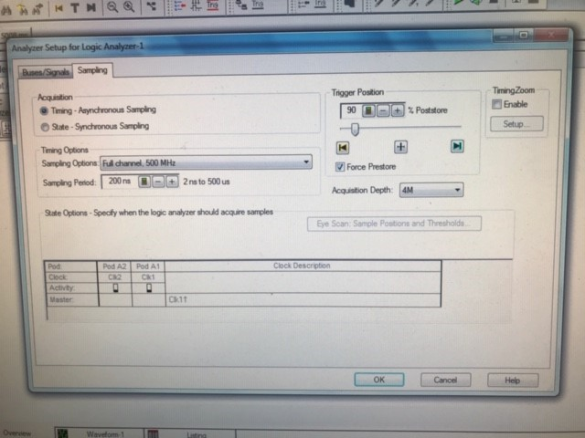
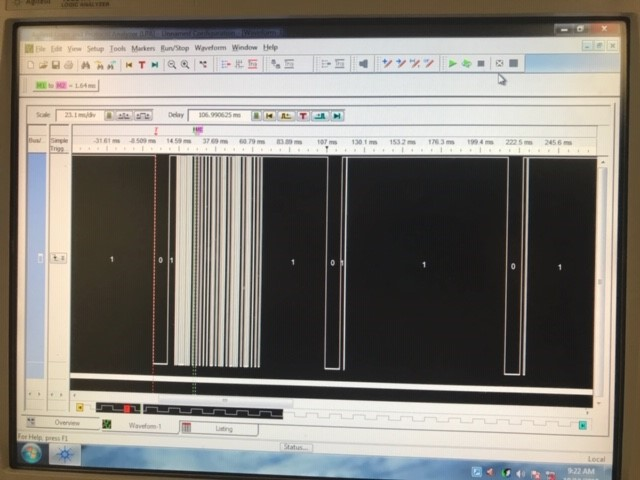
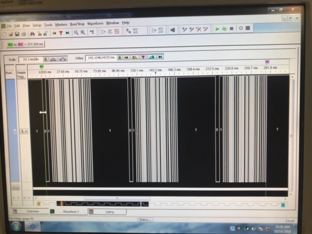
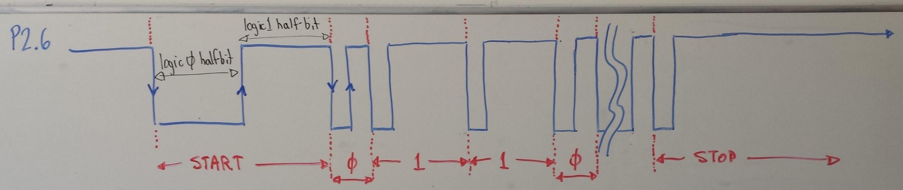

# Lab 3 - Interrupts - "Remote Control Decoding"

You have already seen serial communication in Lab 2, but you will see it again
here. This time, instead of sending the signal across a wire, we will send it
through the air as modulated light.

Your task for this lab is to reverse engineer (hack) an IR remote control so
you can get it to light up some LEDs for you. Unfortunately, IR remotes don't
really follow much of a standard, but they tend to operate similar to each other.
We will exploit that to learn how they work.

## Objectives

- Use the Time A subsystem
- Reverse engineer a protocol
- Use the capture compare peripheral
- Use interrupts
- Combine assembly and C code
- Communicate with external hardware

## Handy References

- IR Receiver TSOP382 [datasheet](../../references/tsop382.pdf)

## Given code

- [test3.c](./test3.c): Use this file to characterize the buttons of your remote
- [start3.c](./start3.c): Initial template file for lab
- [delay_code.asm](./delay_code.asm): simple code that gives you a couple simple delay times written in assembly

# Directions

You will need to use the timer interrupt and the general purpose pin interrupt
to decode a remote control. Be sure to pick one remote for the whole lab, as
remote codes vary between manufacturer.

## Daily Milestones

This lab will be completed in 3 steps:

- **Lab day 1:** Characterize the IR buttons: learn the timing and bit patterns for your remote control (*hint:* use the logic analyzer)
- **Lab day 2:** Use interrupts to capture IR packets: demonstrate your code can receive and decode button presses from the remote control
- **Lab day 3:** Demonstrate turning LEDs on/off

**If you finish a day early, move on to the next**

# Day 1

## Prelab 1

I will not check these, but you need to do them to stay on track.

- Fill in the missing code for [test.c](test.c)
- Print the tables you need for [Day 1 and 2](tables.html)

## Connecting the IR sensor

**Do Not Power Your Board When You Are Wiring It Up!**

Insert the IR receiver module into the protoboard. Look at the datasheet and make
sure you are wiring up the receiver module correctly. When you are looking at
the sensor ball on your IR receiver module, the pin on the left is your signal
pin; the pin in the middle is your ground pin; and the pin on the right is
your Vcc.

{width=50%}

Hook up your Launchpad to the IR module as shown in either picture:

{width=75%}

On your MSP430, connect:

- the sensor signal pin to XIN/P2.6
- the sensor ground pin to the GND pin
- the sensor Vcc pin to Vcc on the MSP430

## Connecting to the Logic Analyzer

When hooking up to the logic analyzer, remember to connect the MSP430 ground to
the logic analyzer ground. Also, hook the signal from the IR sensor to one of
the POD1 inputs bits.

Following the picture above:

- Sampling period: 200 nsec
- Acquisition Depth (how many samples): 4M
- Trigger Position: 90% post store

## Measure Timer Counts

1. Build a project around *your modified* `test3.c` and then download it onto your
LaunchPad. Make sure to open the variables tab (View -> Variables).
    - I also like to clear memory from the Memory Browser tab (View -> Memory Browser), Fill
Memory from 0x200 to 0x400 with 0's.
1. Set the Logic analyzer to "Run Single"
1. Run the program and then press a button on a remote.
1. Pause the program and look at the variables. You should see
something like the following. The values are the captured wave form from the
remote.

  

The values in Timer0 are how long the signal was at zero for and the Timer1
was how long it was high for.

The logic analyzer should look *sort of like* the following:

**WARNING:** On my remote control, the full remote
control signal was about 80ms. Please note that remote control data packets
are not standardized, so the remote that you use to perform these
experiment will almost certainly generate results different  from those that
your neighbor's remote will generate.

Also, different remotes do different things. It appears remotes send the same
command multiple times (~ x3). However, they do it differently.

The above remote sends one good packet and 2 *empty* packets immediately following
one button press.

This remote however, appears to send 3 copies of the same button press.

## Due day 1:

Use the logic analyzer to  measure the following information for your remote.
Show your instructor these:

| Pulse | Duration (ms)	| Timer A counts |
|-------|---------------|----------------|
| Start: logic 0 half pulse  | | |
| Start: logic 1 half pulse  | | | 	 
| Data 1: logic 0 half pulse | | | 	 
| Data 1: logic 1 half pulse | | |	 
| Data 0: logic 0 half pulse | | |	 
| Data 0: logic 1 half pulse | | |	 
| Stop: logic 0 half pulse   | | |
| Stop: logic 1 half pulse   | | |

# Day 2

## Prelab Day 2

- None

## IR data packets

Connect your MSP430 back to the logic analyzer as you did during day 1. Now that
you know the characteristics of your remote, we want to capture the packets now.

Write the codes (in hex) for at least 5 remote control buttons. Make sure you
know both the button and the hex code. You should be able to identify the
start of the message and from there identify the logic 0/1 half pulse.

# Day 2 Turn-in

Show your instructor the following table

| Button | Button name | Hex code (not including start and stop bits) |
|--------|-------------|----------------------------------------------|
| 1      | | |	 
| 2      | | |
| 3      | | |
| 4      | | |
| 5      | | |

# Day 3

## Prelab Day 3

- Fill in the missing code of [start3.c](start3.c) to do the following:
    - You need to have working code (at least something that compiles and does
      everything) if you want to finish on time. **Don't** wait until class to
      start coding!
    - I will not check you did this, but you will be late if you don't do it.

## Main

- Every time the P2.6 pin changes direction, you need to toggle the Red LED on
or off. This is good feedback that our remote works (batteries aren't dead) and
we have setup our interrupts setup correctly
- Every time you get a complete 32b data packet, toggle the Green LED on/off
- Attach two additional LED/resistors, look back at lab 2 if you need to remember
on how to do this, to your Launchpad.
- Pressing button 1 should light up LED 1
- Pressing button 2 should turn off LED 1
- Pressing button 3 should blink LED 2 three times (about 1 second on and 1 second off for each blink)
- Pressing button 4 should blink LED 2 five times (same timings as button 3)
- Pressing button 5 should turn on/off LED 1 and 2

## Port 2 Vector Data Collection

For the IR remote data, you only need to detect the data's logic high as either
a `0` (should be short time) or a `1` (should be a long time)

### Falling Edge

1. Read TAR
1. Classify logic 1 half-pulse and shift bit into `irPacket`
1. Shift the 0 or 1 bit into the `irPacket`
1. Turn Timer A off
1. Enable rising edge interrupt

### Rising Edge

1. set TAR = 0
1. Turn Timer A on
1. Enable Timer A interrupt
1. Enable falling edge interrupt

After both rising/falling edge, clear the `P2IFG`

## Timer 0 Vector

1. Turn off Timer A
1. Turn off Timer A interrupt
1. Clear `TAIFG`

# Day 3 Turn-in

- Demonstrate the buttons working
- **Only push this LED code to bitbucket, not the Day 1/2 code, by the end-of-class**

# Rubric TBD

**WARNING:** This lab has been around and I have made changes to it. When I review
your code, if I see code from the old way to do the lab you will receive 0 pts
for your code. Please do not cheat.

- [5 pts] Day one milestone: Table 1 on-time
- [5 pts] Day two milestone: Table 2 on-time
- [20 pts] Code organization, comments, proper header, repo organization, and good programming practices
    - Push code by end-of-lab on Day 3 so I can review it.
- [10 pts] Launchpad Red LED blinks every time the pin changes direction
- [10 pts] Launchpad Green LED blinks every time a 32b packet is found
- [10 pts] Button 1 works as described
- [10 pts] Button 2 works as described
- [10 pts] Button 3 works as described
- [10 pts] Button 4 works as described
- [10 pts] Button 5 works as described
