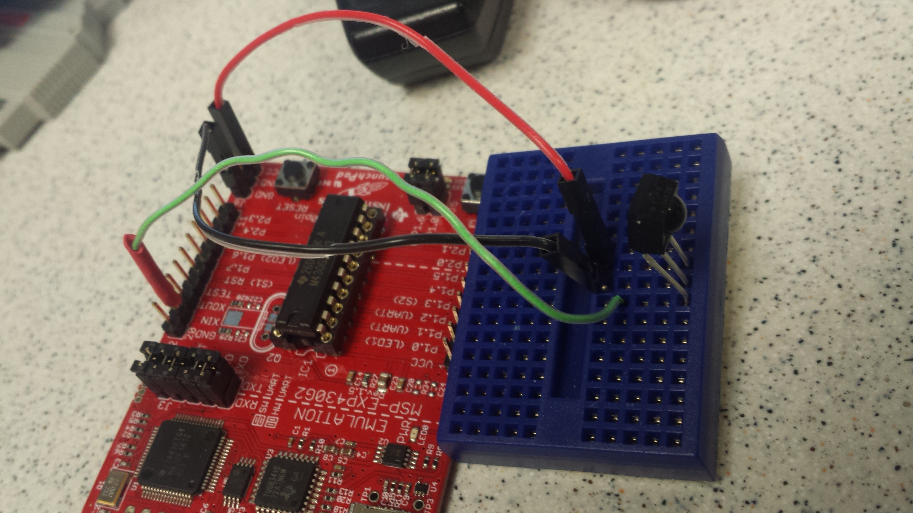
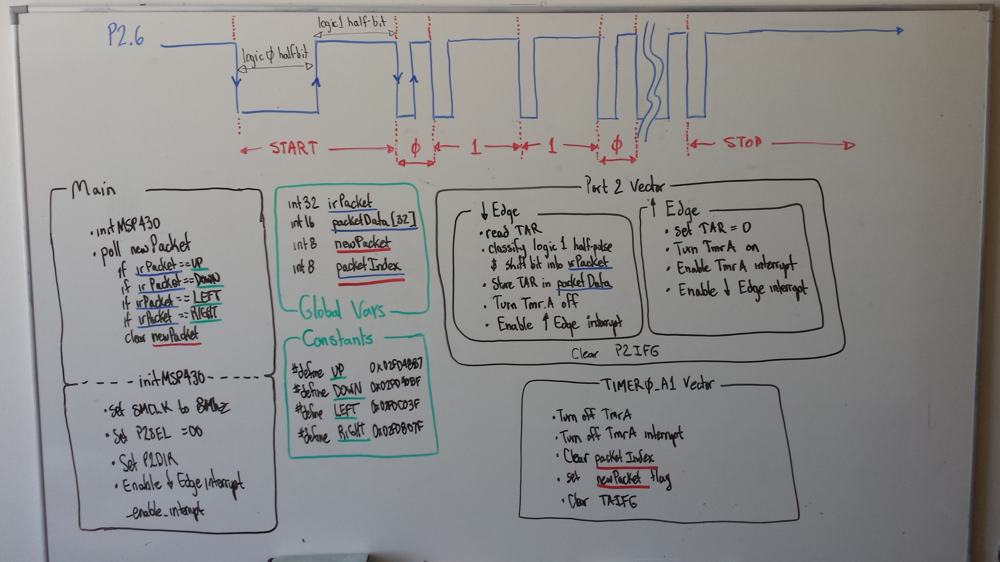

# Lab 3 - Interrupts - "Remote Control Decoding"

## Objectives

- learn how the timer works
- use the capture compare module
- how IR encoding/communications work

In this lab, you'll use your knowledge of interrupts and the Timer_A subsytem to
reverse engineer a remote control.

## Handy References

- Information on the [Sony SIRC Protocol](http://users.telenet.be/davshomepage/home.htm)
- You can verify your remote's button codes [here](http://lirc.sourceforge.net/remotes/)

## Given code

- [test3.c](test3.c) - Use this file to characterize the buttons of your remote
- [start3.c](start3.c) - Initial template file for lab
- [start3.h](start3.h) - Initial template file for lab

## Prelab

A few questions about what goes on in this program are in order before we proceed.

1. How long will it take the timer to roll over?
1.  How long does each timer count last?

The while(1) loop in main reads in the IR pulse in the for loop.

Annotate the picture below to indicate which line of the for loop in the program
is executed at which part of the pulse. You should show a total of 6 lines of
code (lines 32-34 and lines 36-38).

# Directions

You will need to use the timer interrupt and the general purpose pin interrupt
to decode a remote control.  Be sure to pick one remote for the whole lab, as
remote codes vary.

**Lab day 1:** learn the timing and bit patterns for your remote control (*hint:* use the logic analyzer)
**Lab day 2:** demonstrate your code can receive and decode button presses from the remote control

## Connecting the IR sensor

Insert the IR receiver module into the protoboard.  Use M/F wires to connect
your protoboard to your MSP430. Use a regular wire to connect your signal and
ground to the logic analyzer.

When you are looking at the sensor ball on your IR receiver module, the pin on
the left is your signal pin; the pin in the middle is your ground pin; and the
pin on the right is your Vcc.  

On your MSP430, connect the signal pin to XIN/P2.6 on J2, the ground pin to the
GND pin on J6, and the Vcc pin to Vcc on J6.  

#### Timer Counts

Build a project around your modified test5.c and then download it onto your
LaunchPad. Make sure to open the variables tab (View -> Variables). I also like
to clear memory from the Memory Browser tab (View -> Memory Browser), Fill
Memory from 0x200 to 0x400 with 0's. Run the program and then press a button on
a remote. Then pause the program and look at the variables. You should see
something like the following.

#### IR data packets

Before you start on this portion of the assignment, watch
[Dave Jones' Trigger Hold-off Tutorial](http://www.youtube.com/watch?v=ta096oBzSac).
You are going to need to use the logic analyzer to examine the IR waveforms
generated by a remote control of your choice.

Set up your LaunchPad like the picture below. Make sure to connect the power and
ground in the correct order! Connect the logic analyzer on the Vout pin of
the IR receiver.

Configure the logic analyzer to collect data on an edge change, with at least
90% of the data stored post-trigger.  On my remote control, the full remote
control signal was about 80ms. Please note that remote control data packets
are not standardized by any means, so the remote that you use to perform these
experiment will almost certainly generate results different  from those that
your neighbor's remote will generate.

List the lengths of the pulses generated by the remote control in absolute time
using the logic analyzer (3 significant figures) and in timer A counts.  
Note: "start -- logic 0 half pulse" refers to the logic LOW portion of the start
pulse, and "data 0 -- logic 1 half pulse" refers to the second half (which is a
  logic HIGH) of the pulse representing a zero bit.

| Pulse | Duration (ms)	| Timer A counts |
| :-: | :-: | :-: |
| Start -- logic 0 half pulse | | |
| Start -- logic 1 half pulse | | | 	 
| Data 1 -- logic 0 half pulse | | | 	 
| Data 1 -- logic 1 half pulse | | |	 
| Data 0 -- logic 0 half pulse | | |	 
| Data 0 -- logic 1 half pulse | | |	 
| Stop -- logic 0 half pulse | | |
| Stop -- logic 1 half pulse | | | |

Collect and tabulate in Excel eight samples of timer A counts for each of the
following pulse types (in decimal). Compute the average and standard deviation
of each pulse type. I would suggest just grabbing it from the CCS variables tab.

- Data 1, logic 1 half-pulse

- Data 0, logic 0 half-pulse

- Data 0, logic 1 half-pulse

Ensure you label the rows and columns of your table so that I will know what
the information in each cell means.

For each pulse type list the range of timer A counts that would correctly
classify 99.9999426697% of the pulses. This number has something to do with the
[standard deviation](http://en.wikipedia.org/wiki/Standard_deviation#Rules_for_normally_distributed_data)
(hint: look at the table in this section).

Write the codes (in hex) for at least 10 remote control buttons.  ("Button name"
refers to CH+, 6, VOL-, Power, etc.)

| Button | Button name | Hex code (not including start and stop bits) |
| :-: | :-: | :-: |
| 1 | | |	 
| 2 | | |
| 3 | | |	 
| 4 | | |
| 5 | | |	 
| 6 | | |
| 7 | | |
| 8 | | |
| 9 | | |
| 10 | | | |

# Demonstrate Functionality

Turn an LED on and off with one button on the remote (any button is fine). Turn
another LED on and off with a different button.  Turn both LEDs on and off with
a third button.

In addition to the `start.c` and `start.h` files, the below image may be of some use:

