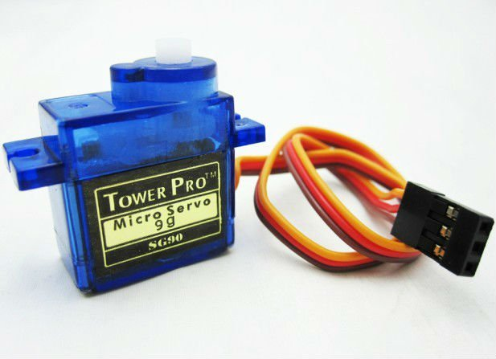
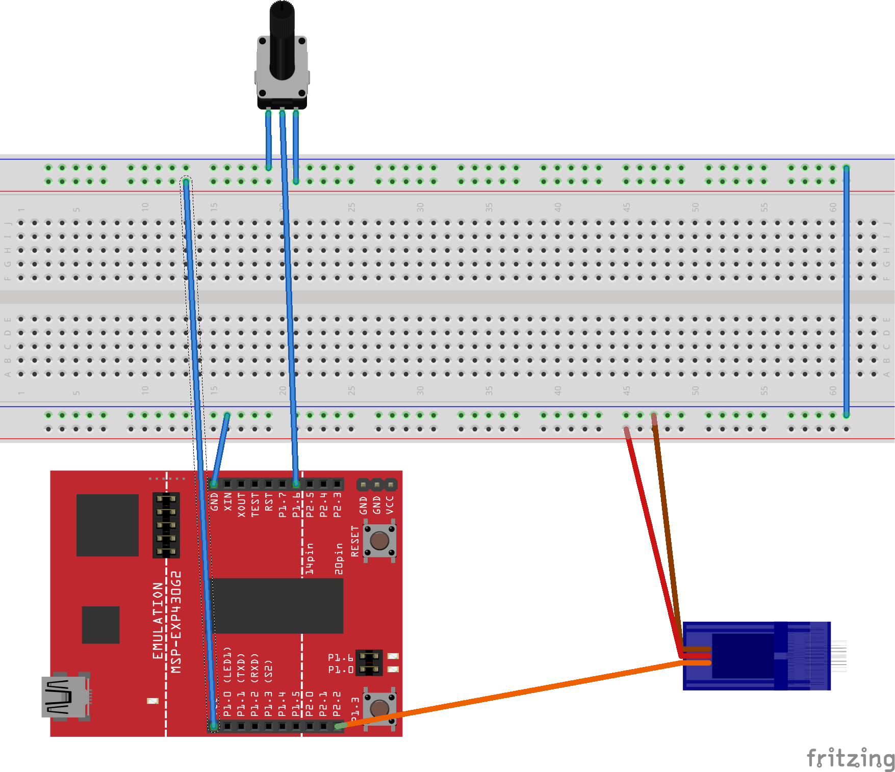
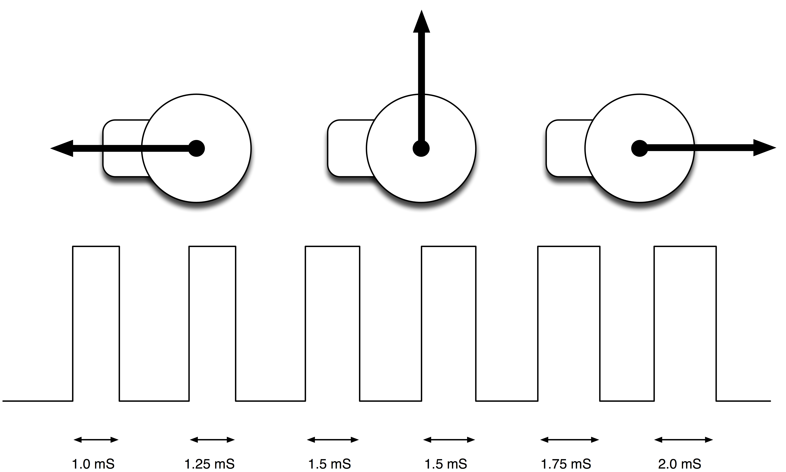

# Lab 4: Servo Calibrator



# Objectives

- Interface with an RC Servo motor using PWM
- Read a potentiometer using the ADC of the uC
- Talk to an LCD using the UART serial bus

# References

- [Servo motor datasheet](../../references/servo.pdf){width=75%}

# Directions

{width=50%}

The goal of this lab is to read a potentiometer (use your ADC) and command a
servo motor using PWM. You will write a couple of functions to set up your uC
to talk to the servo motor. The standard timing for RC servos is:

{width=50%}

Note: there is no standard (really) in RC servos, thus, different servos could
give you different angles with the same PWM signal. They will be *ballpark*
the same, but that isn't always good enough depending on the application.

```{.c}
const int max_pwm = ?;
const int min_pwm = ?;

void servo_attach(int pin){
  /*
  Setup the pwm subsystem to control the servo using pin
  */
}

void servo_write(int angle){
  /*
  Turn the servo to the desired angle.
  input: angle [0-180 deg], if outside range, the input is saturated
  */
  // code
}
```

# Prelab

You will hand-in a flow chart of your program.

Answer the following questions:

- Given your Launchpad operates at 3.3V, is there anything you need to worry
about with this setup? If so, what will you do to mitigate the issues? If not,
why not?
- Identify what ports/pins you are using for this lab and what you will configure
them for?

# Demonstration

Show your instructor your setup works. You should be able to turn the pot knob
and see both the servo move and the LCD print out the angle it turned too.

# Rubric

- [25 pts] Prelab (15 pts flowchart, 10 pts questions)
- [25 pts] Code organization, comments, and good programming practices
- [50 pts] Demonstration in class
