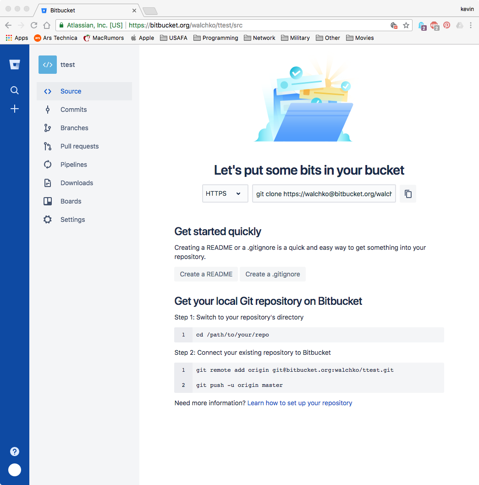

# Git Tutorial

`git` is one of the most common and popular versioning systems in the world.
You are already familiar with it from ECE281, so this should be simple. There
are only a couple of commands for you to learn (and you can only use these)

Only use these commands:

- `clone`: make a copy of a repository located in the internet/cloud
- `pull`: update your local repo with any changes in the repo in the cloud. This is necessary when working in a group or making changes via web browser to bitbucket.
- `status`: are there untracked changes in your local repo?
- `add`: gather up files in your local repo that have changed and you want to save those changes
- `commit`: after files have been added, bundle of them together with a description of the changes
- `push`: send a commit of changes to the repo in the cloud

Although the Codecademy.com lesson showed you more, in this case, **more is not
better!**

## `.gitignore`

CCS is a standard *horrible* IDE that we use. Unfortunately it generates a lot
of files we don't care about and we don't want that junk in our repo.

```bash
# Ignore everything
*
# ok, now we need to bring identify what we want to track
# let's start with:
# - assembly files
# - C files
# - Markdown files and jpg/png images
!.gitignore
!lab*/
!*/*.c
!*/*.h
!*/*.asm
!*.md
!*.jpg
!*.png
!*/
```

Further documentation on `git` is available [here](https://git-scm.com/docs/gitignore).

# Lab Notebook Setup

The layout of your repo should be:
    - ECE382-Your-Last-Name
        - `readme.md`
        - Lab1
            - `main.asm` or `main.c`
        - LabN
            - `main.asm` or `main.c`
        - ICE1
            - `main.asm` or `main.c`
        - ICEN
            - `main.asm` or `main.c`
- Your `readme.md` should contain the following information:
    - picture of you
    - full name
    - what you want to do in the AF
    - interests

# Steps

1. Honestly, the easiest thing to do is go to the interweb (bitbucket) and in your browser, click on the (+) symbol on the lefthand side to create a new repo
    1. Call your repo: ECE382-*<Lastname>*
1. You should see something like this: {width=75%}
1. Now let's `clone` this to our laptops
    1. Make sure the repo address is set to `https`, 10th CS blocks `ssh` (port 22)
1. Now Open up `gitbash`
1. Set some git properties by running these commands:
    1. `git config --global user.name "First Last"`
        1. Stores your name as a property to be used for each commit
    1. `git config --global user.email first.last@usafa.edu`
        1. Stores your email as a property to be used for each commit
    1. Have git remember your login info:
        1. `git config credential.helper wincred`
1. Navigate to the directory where you want to store you projects
1. Next do: `git clone https://walchko@bitbucket.org/walchko/382-walchko.git`
    1. Change the repo address to the one **you** just created
1. Within this repo, create `.gitignore` like the one above
1. Ok, let's check the status of the repo
    1. Type `git status`
    1. This should show a list of files as untracked. The `.gitignore` should be listed there
1. Let's add the file
    1. Type `git add .gitignore`
        1. If you have lots of files, you can use wild cards like `*.c` to add all C files, `*.py` to add all python files (*not this class*), etc.
1. Let's make our first commit.
    1. Type `git commit -m "first commit"`
    1. Should see some data about the change listed
1. Let's look at our commit history.
    1. Type `git log`
    1. This displays all of the commits we've ever made to the repo
    1. Let's make a change to a file in our repo
1. Let's check the status now
    1. Type `git status`
    1. Everything should be up do date now

## Working with Bitbucket from the Browser

If you create, add or modify a file from the browser (remember you are modifying the repo in the cloud, not on your computer), so you should always do `git pull` first to update your local repo on your laptop. If you don't and you make changes to the same file on your computer, git doesn't know what changes you really want. It just knows two files are different and the cloud and your computer repos are out of sync!

This is also a good reason for branching, which we won't do in the class. But, if you have many different people working on the same code, you will create different branches so things can be merged back together cleanly. I would keep this in mind for capstone, but no one ever uses it primarily because our IT infrastructure is crap because of 10th CS.

## Oops!

Honestly, be careful with Google. If you wildly throw `git` commands at your system you will break it. If your *buddy* tells you to do something you don't understand, you could break your repo. **If you break your repo**, then it is up to you to fix it. Everything you need for the class is above, you should **never** need to come to an instructor because *your repo is broken*. On the positive side, if you break it, you will learn a lot about `git` trying to fix it!

# In Class Exercise (ICE)

1. Create a new project in your repo called `ice1` and make sure to select assembly only.
2.
